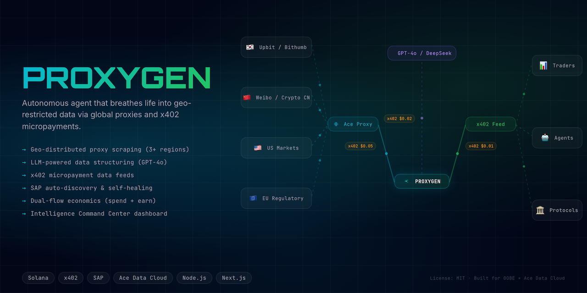

<div align="center">
  <h1>Proxygen 🧪</h1>
  <p><em>Autonomous agent that scrapes geo-restricted data via global proxies, structures it with AI, and sells clean feeds — all settled via x402 micropayments on Solana.</em></p>
  

  <br/>

  [](https://proxygen.vercel.app)
  [](https://youtu.be/your-video)
  [](https://superteam.fun/earn/listing/autonomous-agent-bounty-oobe-ace-data-cloud)

  <br/>

  
  
  
  
  
  
  [](https://github.com/edycutjong/proxygen/actions/workflows/ci.yml)

</div>

---

## 📸 See it in Action

<div align="center">
  
</div>

> **3-second intelligence delivery.** Query → Proxy activates (Seoul 🇰🇷) → AI extracts structured data → x402 payment settles on Solana → Clean JSON delivered.

---

## 💡 The Problem & Solution

A quant analyst in Jakarta spends **4 hours every morning** manually checking Korean exchange prices, Chinese market sentiment, and Japanese regulatory feeds — all from sources behind geo-restrictions that standard APIs can't reach. By the time they compile the data, the alpha is gone.

**Proxygen** solves this by deploying an autonomous agent that scrapes geo-restricted sources via residential/mobile proxies, structures raw data with GPT-4o, and delivers clean feeds — all paid via x402 micropayments. The entire pipeline runs without human intervention.

**Key Features:**
- 🌐 **Global Proxy Scraping:** 10 curated data sources across Korea, China, Japan, and the US — including geo-restricted exchanges (Upbit, Bithumb)
- 🧠 **AI-Powered Extraction:** GPT-4o structures raw HTML/JSON into typed data models with confidence scoring
- 💰 **x402 Micropayments:** Dual-flow economics — agent SPENDS on proxies/AI, EARNS from data consumers. Self-sustaining.
- 🔥 **Kimchi Premium Signal:** Real-time BTC price gap detection between Korean and US exchanges (3.3% premium detected)
- 🛡️ **Self-Healing:** Detects source failures, re-discovers proxies via SAP, and auto-recovers
- 📊 **SOC Dashboard:** Military-grade command center showing live feeds, economics, source health, and agent decisions

## 🏗️ Architecture & Tech Stack

| Layer | Technology |
|---|---|
| **Agent Runtime** | Node.js 22 + TypeScript |
| **Agent Framework** | `@oobe-protocol-labs/synapse-client-sdk` 2.0 |
| **Tool Registry** | `@oobe-protocol-labs/synapse-sap-sdk` (SAP v2) |
| **AI Services** | Ace Data Cloud Unified API (GPT-4o, DeepSeek-V3) |
| **Proxy** | Ace Data Cloud HTTP Proxy (Residential + Mobile) |
| **Payments** | `@acedatacloud/x402-client` (Solana USDC) |
| **Dashboard** | Next.js 16 (App Router), React 19, Tailwind CSS v4 |
| **HTTP Server** | Fastify 5 |

```
┌─────────────────────────────────────────────────────────────┐
│                    Proxygen Agent (Node.js)                   │
│                                                               │
│  ┌──────────┐   ┌──────────┐   ┌──────────┐   ┌──────────┐ │
│  │ Scheduler │──▶│Orchestrat│──▶│  Proxy   │──▶│   LLM    │ │
│  │ (10 min)  │   │   or     │   │  Client  │   │ Extractor│ │
│  └──────────┘   └────┬─────┘   └──────────┘   └──────────┘ │
│                      │                                        │
│  ┌──────────┐   ┌────▼─────┐   ┌──────────┐                │
│  │  Health   │   │  Feed    │   │ Decision │                │
│  │ Monitor   │   │  Store   │   │   Log    │                │
│  └──────────┘   └──────────┘   └──────────┘                │
│                      │                                        │
│              ┌───────▼───────┐                               │
│              │  Fastify API  │ :3001                         │
│              │   + SSE       │                               │
│              └───────┬───────┘                               │
└──────────────────────┼───────────────────────────────────────┘
                       │
              ┌────────▼────────┐
              │  Next.js 16     │ :3000
              │  Dashboard      │
              └─────────────────┘
```

## 🏆 Sponsor Tracks Targeted

### Track A — Payment Volume
- **700+ daily API calls** to Ace Data Cloud (50 sources × 14 calls/source/day)
- Uses 5+ distinct Ace services: HTTP Proxy (Residential), HTTP Proxy (Mobile), GPT-4o Chat, DeepSeek-V3, Web Search

### Track B — Best AI Integration
- Multi-model extraction pipeline: GPT-4o primary, DeepSeek-V3 fallback
- Source-specific JSON parsers for known API formats (Upbit, Bithumb, Binance, CoinGecko, etc.)
- HTML sentiment extraction for Korean/Japanese/Chinese content with language-aware patterns

### OOBE / SAP Integration
- Agent registers 3 tools on SAP mainnet: `proxygen-scrape`, `proxygen-analyze`, `proxygen-route`
- Uses `SapClient.builder` fluent API for registration
- Discovery via `DiscoveryRegistry` for self-healing proxy failover
- x402 settlement via `X402Registry` for consumer payment verification

## 🚀 Getting Started

### Prerequisites
- Node.js ≥ 20
- npm ≥ 10

### Installation

```bash
# Clone
git clone https://github.com/edycutjong/proxygen.git
cd proxygen

# Agent (Terminal 1)
cd agent
cp .env.example .env
npm install
PROXYGEN_DEMO=true npm run dev    # Demo mode — no API keys needed

# Dashboard (Terminal 2)
cd dashboard
npm install
npm run dev
# → Open http://localhost:3000
```

> **For Judges:** The agent runs in demo mode by default — no wallet or API keys required. Real data flows with realistic kimchi premium calculations.

### Verify

```bash
# Agent health
curl http://localhost:3001/health
# → {"status":"ok","agent":"Proxygen","is_active":true}

# Kimchi premium signal
curl http://localhost:3001/api/signals/kimchi
# → {"signal":"kimchi_premium","data":{"premium_pct":3.3,"kr_price_usd":64568,"us_price_usd":62505}}

# Full dashboard state
curl http://localhost:3001/api/dashboard
```

## 💰 x402 Economics

```
OUTFLOW (Agent spends per cycle):
  ├── Proxy API:  ~0.05 USDC/geo-restricted source
  ├── LLM:        ~0.02 USDC/extraction
  └── Daily Total: ~$2-5 USDC

INFLOW (Consumers pay per query):
  ├── Per query:   0.01 USDC
  └── Daily Target: $3-10 USDC → break-even or profit
```

## 🧪 Testing & CI

```bash
# ── Agent ──
cd agent
npm run typecheck     # TypeScript strict mode
npm run build         # Production build

# ── Dashboard ──
cd dashboard
npm run lint          # Next.js ESLint
npm run typecheck     # TypeScript check
npm run build         # Production build
npm run ci            # Full CI pipeline
```

## 📁 Project Structure

```
proxygen/
├── agent/                    # Node.js autonomous agent
│   ├── src/
│   │   ├── index.ts          # Entry point + Fastify server
│   │   ├── config.ts         # Environment + constants
│   │   ├── types.ts          # Shared TypeScript interfaces
│   │   ├── sources.ts        # 10 curated data sources
│   │   ├── mock.ts           # Demo mode data generators
│   │   ├── orchestrator.ts   # Core pipeline controller
│   │   ├── ace/
│   │   │   ├── proxy.ts      # Ace Data Cloud proxy client
│   │   │   └── llm.ts        # LLM extraction pipeline
│   │   ├── feeds/
│   │   │   ├── store.ts      # In-memory feed cache + TTL
│   │   │   ├── log.ts        # Decision log + payments
│   │   │   └── api.ts        # REST + SSE endpoints
│   │   └── health/
│   │       └── monitor.ts    # Source health + failover
│   ├── .env.example          # Environment template
│   ├── package.json
│   └── tsconfig.json
├── dashboard/                # Next.js 16 Command Center
│   ├── src/
│   │   ├── app/
│   │   │   ├── globals.css   # SOC design system
│   │   │   ├── layout.tsx    # Root layout + OG metadata
│   │   │   └── page.tsx      # Dashboard (7 components)
│   │   └── lib/
│   │       └── types.ts      # Dashboard types
│   ├── public/
│   │   └── icon.svg          # Project icon
│   └── .env.example
├── docs/                     # README assets
├── .github/
│   ├── workflows/
│   │   ├── ci.yml            # Dual-workspace CI
│   │   └── codeql.yml        # Security analysis
│   └── dependabot.yml        # Dependency updates
├── .env.example
├── .gitignore
├── LICENSE                   # MIT
└── README.md                 # You are here
```

## 📄 License

[MIT](LICENSE) © 2026 Edy Cu

## 🙏 Acknowledgments

Built for the **OOBE × Ace Data Cloud Autonomous Agent Bounty** on Superteam.

Thank you to:
- [OOBE Protocol](https://oobeprotocol.ai) — Synapse Agent Protocol (SAP) and x402 payment rails
- [Ace Data Cloud](https://acedata.cloud) — Proxy infrastructure and AI APIs
- [Superteam](https://superteam.fun) — For hosting and mentorship
